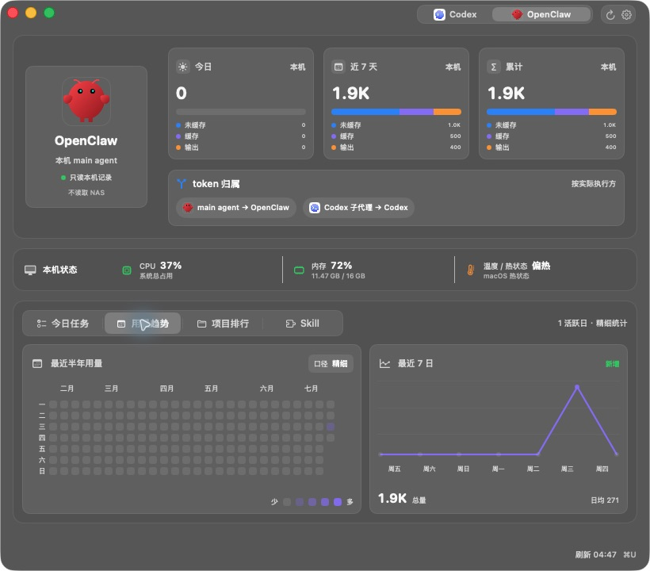
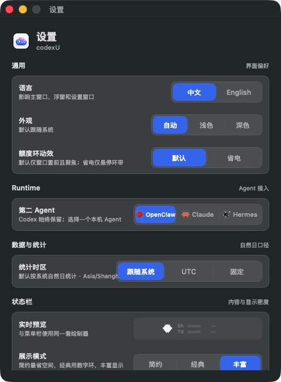
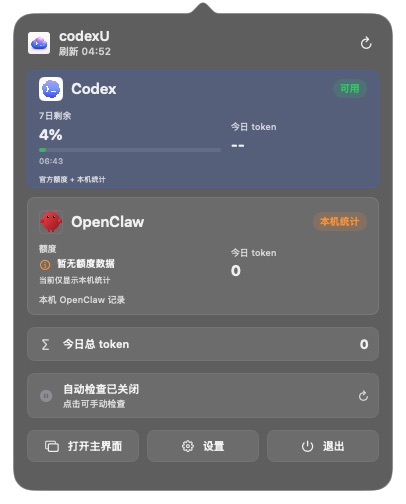
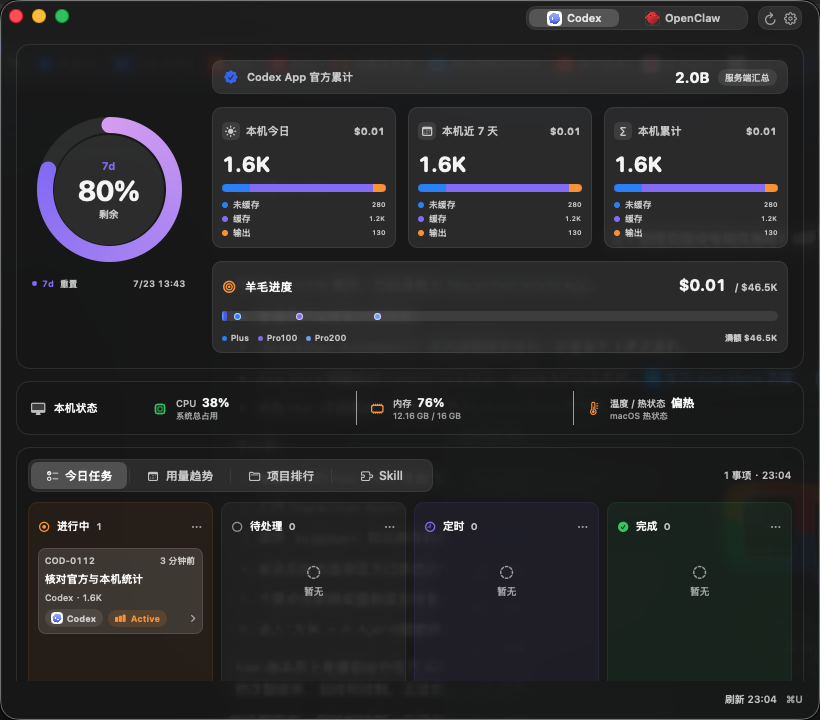

# codexU

> [!IMPORTANT]
> **Local multi-Agent custom build.** Codex always stays enabled. Settings lets you choose exactly one companion Agent: OpenClaw, Claude Code, or Hermes. Tokens are attributed to the runtime that executed them, tasks carry an explicit source badge, and unselected Agents are not scanned. Automatic upstream update checks are disabled to preserve this customization.

## Source and Acknowledgements

This project is a local customization of [shanggqm/codexU](https://github.com/shanggqm/codexU) `v1.0.5`. It follows the upstream MIT License and preserves the original copyright and attribution to Guomeiqing. Thank you to the original author for open-sourcing the Codex quota, usage-tracking, and native macOS foundation.

The OpenClaw integration follows the local formats and brand resources from [openclaw/openclaw](https://github.com/openclaw/openclaw). Hermes support follows Nous Research's MIT-licensed [Hermes Agent](https://github.com/NousResearch/hermes-agent) default-profile database and official logo. Thank you to these open-source projects and communities for providing verifiable, extensible local-Agent foundations. Claude Code support and its image resources are restored from upstream codexU; Claude Code is an Anthropic product. This project is not affiliated with or endorsed by OpenAI, Anthropic, OpenClaw, or Nous Research. See [THIRD_PARTY_NOTICES.md](THIRD_PARTY_NOTICES.md) for complete notices.

codexU is a macOS menu bar and desktop app for tracking Codex quota, separate Codex/companion-Agent token usage, and a unified task board.







## v1.1.2 Codex App Official Usage

v1.1.2 displays the official lifetime token total returned by the Codex App `account/usage/read` endpoint directly at the top of the Codex dashboard. codexU previously read this field but did not expose it in the interface, leaving only local session totals visible and making the two sources look as if they should match.

The official value is explicitly labeled “Codex App official lifetime / Server summary.” The existing cards are renamed “Local today / Local 7 days / Local lifetime.” Local events remain the source for cache/input/output splits, trends, project attribution, and API-equivalent value because the official summary does not provide those details and its daily buckets can update later than local events.



## v1.1.1 Usage Fix

v1.1.1 fixes inflated Codex token details in long-running or concurrent sessions. Codex cumulative `total_token_usage` snapshots can occasionally move backwards by a small amount; the previous parser treated every regression as a counter restart and added the entire cumulative snapshot again. codexU now prefers the explicit per-event `last_token_usage`. For older events without that field, negative cumulative corrections can no longer re-add a full session total. Affected analytics caches are invalidated and rebuilt automatically after upgrade.

codexU's today, last-7-days, and lifetime token totals come from local session events. The Codex App usage page uses a server-side summary that can differ because of reporting delay, time-zone boundaries, and quota weighting, so the two sources are not expected to match at every moment.

## Who It Is For

- Developers who use OpenAI Codex, Codex CLI, or the Codex desktop app every day.
- Developers who use Codex with OpenClaw, Claude Code, or Hermes and want one local view for both runtimes.
- ChatGPT Pro / Team users who want a quick view of Codex 5-hour quota, 7-day quota, token usage, and reset times.
- macOS users who want to check Codex status without repeatedly opening a browser or terminal.

## Features

- Shows remaining and used Codex quota for the 5-hour and 7-day windows, including reset times; quota types are classified by their protocol-reported durations and trusted responses automatically select a single- or dual-quota layout.
- Shows separate Codex and selected-Agent menu bar cards with per-runtime token totals; the Codex card also shows 5-hour/7-day quota.
- Offers transparent Minimal, Classic, and Rich menu bar modes: Minimal keeps thicker quota rings, Classic keeps the quota number inside each progress ring, and Rich keeps full labels, bars, and reset times. A single active window automatically collapses to a single-quota layout.
- Preserves the full ring particle effect while rendering it only when the main window is visible, frontmost, and focused by default. Power Saving mode renders particles only while the ring is hovered, and animation stops in the background or under Low Power, thermal, and Reduce Motion constraints.
- Lets you switch menu bar quotas between used and remaining, choose 5-hour, 7-day, today tokens, and reset countdown, and keeps 5h/7d progress colors aligned with the main blue-purple quota rings.
- Uses progress direction instead of extra labels: used runs clockwise/left-to-right, while remaining runs counterclockwise/right-to-left.
- Uses monochrome templates derived exactly from the original Runtime logos and resolves icon/text colors from the menu bar's effective appearance; branded color icons remain in the main window and popover.
- Shows today's total tokens as one vertically centered number in the menu bar, without an extra `T` label.
- Uses the system menu bar body size for today's total and a higher-contrast supporting foreground for 5h/7d labels and reset times while preserving hierarchy beneath primary values.
- Keeps Codex enabled and lets Settings choose one companion Agent from OpenClaw, Claude Code, or Hermes; the main window, menu bar, and aggregate update together.
- Does not read or aggregate an unselected Agent. If the selected Agent is missing or has no records, codexU reports it as unavailable instead of silently switching.
- Supports OpenClaw main-agent transcripts, Claude Code local sessions, and Hermes default-profile `state.db` for tokens, trends, projects, tools, and tasks.
- Codex tokens remain attributed to Codex when invoked by OpenClaw or Hermes; explicitly Codex-backed records are excluded from companion totals.
- Task cards show Codex/OpenClaw/Claude Code/Hermes source badges and keep the existing detail-view click behavior; valid Codex threads can be opened directly in Codex from that detail view.
- Shows local total CPU use, physical-memory use, and temperature/thermal state; when no public temperature sensor is available, it reports the macOS thermal state instead of inventing a temperature.
- Summarizes token usage for today, the last 7 days, and lifetime totals with uncached input, cached input, and output splits.
- Estimates the current month's API-equivalent value from OpenAI API token prices and shows progress against Plus, Pro 100, Pro 200, and the full monthly quota value. The bar uses a segmented nonlinear scale, so movement past Pro 200 remains visible and is not a linear dollar ratio.
- Adds lower dashboard tabs for today's tasks, usage trend, project ranking, and Skill usage.
- Builds a daily task board from local Codex threads and enabled Codex automations, grouped into active, pending, scheduled, and done columns.
- Shows a six-month daily token heatmap, a last-7-day trend summary, and previous-period comparison.
- Shows recent and all-time project rankings with tokens, estimated value, thread counts, and recent activity.
- Shows top tool calls and top Skill usage to explain the structure of local Codex work.
- Runs as a standard macOS window with Dock, system window controls, minimization, and optional background running after the main window is closed. Closing the main window hides the Dock icon and keeps the menu bar item.
- Uses `Command + U` by default to show or hide the main window, and the shortcut can be customized in Settings. The menu bar runtime menu can also open the main window, open settings, or quit.
- Includes a Settings window for companion-Agent selection, Chinese/English UI text, system/light/dark appearance, menu bar content with live preview, always-on-top behavior, close-window behavior, system status, and update check configuration.
- Disables automatic GitHub Release checks in this custom build while keeping the manual check action available.
- Reads data locally and does not upload usage, threads, or account data to a third-party service.

## Keyboard Shortcuts

- `Command + U`: shows or hides the main window by default and can be customized in Settings. If the window is minimized, the shortcut restores it and brings it forward.
- Custom combinations require at least two modifiers, including Command or Control; known high-risk system and accessibility shortcuts are rejected.
- Press Backspace while recording to clear the shortcut, or Escape to cancel; you can restore the default or record another shortcut later.
- The app detects conflicts with other exclusive hotkey registrations. macOS does not provide a complete query for nonexclusive registrations, so choose another combination if another app still conflicts.
- Menu bar gauge icon: opens the runtime menu. Clicking the Codex or selected-Agent card opens the main widget with that runtime selected.
- Menu bar runtime menu: shows quick Codex and selected-Agent status and provides Open, Settings, and Quit actions.
- Settings window: choose OpenClaw, Claude Code, or Hermes; configure language, appearance, menu bar mode/quota direction/visible metrics, always-on-top and close-window behavior; or manually check GitHub Releases from the System section.
- Main-window refresh button: immediately refresh quota, token usage, trend, and task board.
- System window controls: close, minimize, or zoom the main window. After closing, reopen from the menu bar item or shortcut; quit from the menu bar runtime menu or the app menu.

## First Install: Privacy & Security

codexU is distributed outside the Mac App Store. On first launch, macOS may block it until you manually allow it:

1. Open `codexU.app` once. If macOS says it cannot be opened, cancel the dialog.
2. Open **System Settings > Privacy & Security**.
3. In the **Security** section, click **Open Anyway** for `codexU.app`.
4. Confirm with Touch ID or your password, then click **Open**.

You can also right-click `codexU.app` in Finder and choose **Open**, then confirm the same security prompt.

codexU always reads local Codex data under `~/.codex/`. It reads structured usage and task metadata only for the selected Agent under `~/.openclaw/`, `~/.claude/`, or `~/.hermes/state.db`. This build does not read a NAS OpenClaw instance.

## Install

Download the DMG for your Mac architecture from GitHub Releases:

- Apple Silicon: `codexU-<version>-mac-arm64.dmg`
- Intel: `codexU-<version>-mac-x86_64.dmg`

1. Open the DMG.
2. Drag `codexU.app` into the `Applications` folder.
3. Open codexU from `Applications`.
4. Complete the **First Install: Privacy & Security** steps above if macOS blocks the first launch.

After installation, codexU does not automatically check for or install upstream versions. A manual check remains available in Settings.

## Requirements

- macOS 14 or later.
- A local Codex installation.
- A signed-in Codex account for quota data.
- Codex must have been used at least once so `~/.codex/state_5.sqlite` exists.
- A companion Agent is optional: OpenClaw uses `~/.openclaw/agents/main/sessions/*.jsonl`, Claude Code uses `~/.claude/projects/**/*.jsonl`, and Hermes uses the default profile at `~/.hermes/state.db`.
- Xcode Command Line Tools for building from source.

## Build From Source

```sh
make build
```

Run the app:

```sh
make run
```

Install to `/Applications`:

```sh
make install
```

Inspect the data source output:

```sh
make probe
```

## Package A DMG

```sh
make release
```

`make release` builds a DMG for the current build machine architecture. You can also build explicit Mac architectures:

```sh
make release-arm64
make release-intel
make release-all
```

Release artifacts are written to `dist/`, for example:

```text
dist/codexU-1.1.2-mac-arm64.dmg
dist/codexU-1.1.2-mac-arm64.dmg.sha256
dist/codexU-1.1.2-mac-x86_64.dmg
dist/codexU-1.1.2-mac-x86_64.dmg.sha256
```

For Developer ID signing and notarization, see [DISTRIBUTION.md](DISTRIBUTION.md).

## Data Sources

- Account and quota: `codex app-server` JSON-RPC methods `account/read`, `account/rateLimits/read`, and `account/usage/read`.
- Codex token totals: `~/.codex/state_5.sqlite`, plus `~/.openclaw/agents/codex/agent/codex-home/state_5.sqlite` for Codex runs invoked by OpenClaw.
- Detailed token splits: `token_count` events in `~/.codex/sessions/**/rollout-*.jsonl` and `~/.codex/archived_sessions/*.jsonl`.
- Today's board: unarchived and archived Codex threads in the local SQLite database.
- Usage trends and project rankings: aggregated from local session `token_count` events, with an approximate thread-updated-time fallback when detailed events are unavailable.
- Tool and Skill usage: tool call and Skill load records parsed from local session events.
- Scheduled tasks: enabled automation metadata under `~/.codex/automations/**/automation.toml`.
- OpenClaw tokens: assistant `message.usage` fields in `~/.openclaw/agents/main/sessions/*.jsonl`; records explicitly marked with a Codex provider/model, NAS, and the OpenClaw Codex subagent directory are excluded.
- OpenClaw tools and tasks: main-agent transcript `toolCall` entries, `~/.openclaw/workspace/memory/tasks.json`, and the current-day session index.
- OpenClaw has no trusted local quota source, so quota is shown as unavailable instead of zero.
- Claude Code: local transcripts under `~/.claude/projects/**/*.jsonl`, local stats cache, statusLine snapshots, and task metadata. `~/.claude` is not scanned unless Claude Code is selected.
- Hermes: structured session/message fields in the default profile at `~/.hermes/state.db`. Calendar-day trends are approximated from session last-activity times, and explicit Codex-backed sessions are excluded from Hermes token totals. The database is not opened unless Hermes is selected.
- Update checks: the GitHub Releases API is accessed only after a manual check.

Current Codex quota APIs expose rolling-window percentages and reset times, not absolute account quota sizes. Companion-Agent values are local-record statistics, not an official billing view.

## FAQ

### Is codexU an official OpenAI product?

No. codexU is an unofficial local macOS utility for reading local Codex app-server responses and local `~/.codex/` data.

### Does codexU upload my Codex threads or usage data?

No. codexU reads Codex quota, local SQLite usage, and automation metadata locally. It does not upload that data to a third-party service. Update checks only request public GitHub Release metadata and do not include local usage, threads, paths, logs, or account data.

### Why does codexU show remaining percentage instead of absolute quota?

The current local Codex API exposes rolling-window usage percentages and reset times, not absolute quota sizes. codexU therefore shows remaining percentages for the 5-hour and 7-day windows.

### Does codexU support Intel Macs?

Yes. Intel Macs should use `codexU-<version>-mac-x86_64.dmg`. From source, package it with `make release-intel`, or override `TARGET_TRIPLE="x86_64-apple-macos14.0"` from a compatible toolchain.

### Can OpenClaw, Claude Code, and Hermes all be shown at once?

No. v1.1.0 deliberately uses “Codex + one companion Agent.” This avoids scanning tools you are not using and keeps attribution and the menu bar clear. New Agents are added through independent providers without changing the existing providers' accounting.

## License

MIT. See [LICENSE](LICENSE).
